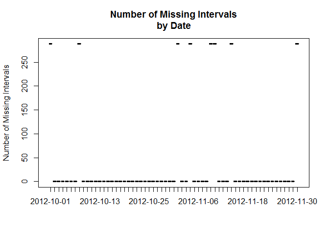
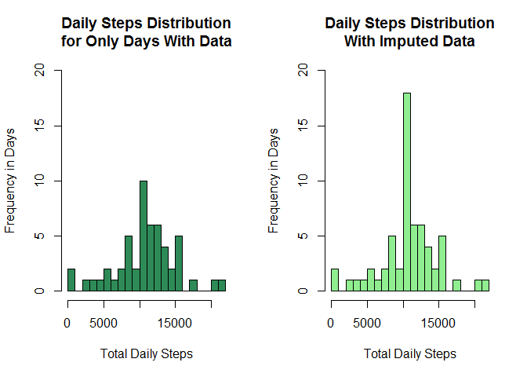

# Reproducible Research: Peer Assessment 1


```r
require("lubridate", warn.conflicts = FALSE, quietly = TRUE)
require("dplyr", warn.conflicts = FALSE, quietly = TRUE)
```

## Loading and preprocessing the data

Read the data from the [fork of the course git repository][1]. The repository was originally forked from [Reproducable Research Coursera repository][2] on May 4, 2015. The "steps" variable is of type integer with missing values represented as "NA". The "date" variable format is "yyyy-mm-dd" and the "interval" variable format is "hhmm" with leading zeros dropped. "date" and "interval" variables have no missing values. The data is cached to improve iteration processing time.


```r
activity <- tbl_df(read.csv("activity.csv"))
```

## What is mean total number of steps taken per day?

Here is the frequency distribution of the total number of steps taken each day of the study.


```r
# analysis across all days in the study, whether data were collected or not
all.daily.steps.count <- activity %>% 
                         group_by(date) %>% 
                         summarize(step.cnt = sum(steps, na.rm = TRUE))

# analysis across only the days of the study when data were collected
daily.steps.count <- aggregate(steps ~ date, activity, sum, na.rm=TRUE)

# and the associated plots
par(mfrow=c(1,2))
hist(all.daily.steps.count$step.cnt,
     breaks = 20,
     col="firebrick",
     xlab = "Total Daily Steps",
     ylab = "Frequency in Days",
     main = "Daily Steps Distribution\nfor All Days")

hist(daily.steps.count$steps,
     breaks = 20,
     col="seagreen",
     xlab = "Total Daily Steps",
     ylab = "Frequency in Days",
     main = "Daily Steps Distribution\nfor Only Days With Data")
```

 

```r
all.daily.steps.mean <- mean(all.daily.steps.count$step.cnt)
all.daily.steps.median <- median(all.daily.steps.count$step.cnt)

daily.steps.mean <- mean(daily.steps.count$steps)
daily.steps.median <- median(daily.steps.count$steps)
```

The mean number of steps taken across all days of the study is 9354.23 and the median is 10395 steps, if the days missing data are included. Given that there are eight days in the study for which data are not available, counting those days in the average calculations skews the averages downward, as can be seen in the histograms above. Counting the days missing data in the averages calculations implicitly imputes the missing data to be zero steps. Instead, we should only look at the days in the study for which data are available and calculate the averages from them. Using only the days that data ***are*** available, the **mean** number of steps taken each day data were collected during the study is **10766.19** and the **median** is **10765** steps.

## What is the average daily activity pattern?

Here is a graph of the daily activity averaged across all the days of the study. The x-axis is the interval and is congruent with military time, i.e. 500 is 5 AM and 1500 is 3 PM.


```r
# analysis across only the days of the study when data were collected
interval.mean.steps <- aggregate(steps ~ interval, 
                                 activity, 
                                 mean, na.rm=TRUE)

with(interval.mean.steps, 
     plot(steps ~ interval, 
          type = "l",
          xlab = "Interval",
          ylab = "Average Steps per Interval",
          main = "Average Daily Activity")
     )
```

 

```r
max.interval <- with(interval.mean.steps,
                     interval.mean.steps[steps == max(steps),]
)
```

The interval with the greatest number of steps, on average across all the days data were collected, is **interval 835** with *206* steps, on average.

## Imputing missing values


```r
# how many observations (at 5 minute intervals) per day? => 288
daily.obs <- (60 / 5) * 24

# get a count of the number of missing values for each day => 2304
daily.nas <- activity %>% 
             group_by(date) %>% 
             summarize(na.cnt = sum(is.na(steps)))
missing.step.values <- sum(daily.nas$na.cnt)

# what's the distribution of missing valuses
plot(daily.nas$na.cnt ~ daily.nas$date, 
     xlab = "",
     ylab = "Number of Missing Intervals",
     main = "Number of Missing Intervals\nby Date")
```

 

```r
# how many days have missing values? => 8
empty.dates <- daily.nas[daily.nas$na.cnt > 0, "date"]
empty.day.count <- nrow(empty.dates)
```

The total number of missing values is **2304**. From the graph above, it appears that a day either has data or it does not. There appear to be no partially measured days. The number of missing days is *8*.

The strategy to impute the missing data will be to replace the missing interval data with their corresponding average over the days data were actually collected.


```r
# impute the data for the missing intervals
imputed.activity <- activity %>%
                    mutate(steps = ifelse(is.na(steps), 
                                          interval.mean.steps$steps, 
                                          steps))

# Sum the steps across all the days of the study with imputed data
imputed.daily.steps.count <- aggregate(steps ~ date, imputed.activity, sum)

#  compare with the same plot and averages as before using the imputed data
par(mfrow=c(1,2))

hist(daily.steps.count$steps,
     breaks = 20,
     ylim = c(0, 20),
     col="seagreen",
     xlab = "Total Daily Steps",
     ylab = "Frequency in Days",
     main = "Daily Steps Distribution\nfor Only Days With Data")

hist(imputed.daily.steps.count$steps,
     breaks = 20,
     ylim = c(0, 20),
     col = "lightgreen",
     xlab = "Total Daily Steps",
     ylab = "Frequency in Days",
     main = "Daily Steps Distribution\nWith Imputed Data")
```

 

```r
imputed.steps.mean <- mean(imputed.daily.steps.count$steps)
imputed.steps.median <- median(imputed.daily.steps.count$steps)
```

The *mean* of the imputed data set (10766.19) is the same as the mean of the original data set when using only the days where data were available (10766.19). This is expected given the strategy to impute missing data was to substitute the mean steps per interval. As noted above, this mean is significantly different if all days are included and the missing data are imputed to have a value of zero (9354.23).

The *median* is also affected by the strategy used to impute missing data. Imputing the missing data to be the mean of the known data brings the median of the known data (10765) closer to the imputed mean (10766.19) because the strategy increases the number of days with the mean number of steps. In this specific case, the imputed median (10766.19) is the same as the known data mean. Again, note that there is a significant difference between the known data median (10765) and the imputed median (10395) if the imputation strategy is to treat the missing data as zero.

## Are there differences in activity patterns between weekdays and weekends?


```r
# add a work week factor distinguishing between work days and weekends
work.week.activity <- imputed.activity %>%
                      mutate(workweek = as.factor(
                        ifelse(wday(date, label = TRUE) %in% c("Sat", "Sun"),
                               "Weekend", "Weekday"))) 

# average steps per interval, grouped by workweek
work.week.mean.steps <- work.week.activity %>% 
                        group_by(workweek, interval) %>% 
                        summarize(mean.steps = mean(steps, na.rm = TRUE))

# plot weekday activity versus weekend activity
require("lattice", warn.conflicts = FALSE, quietly = TRUE)
xyplot(mean.steps ~ interval | workweek, 
       data = work.week.mean.steps, 
       type = "l",
       xlab = "Interval",
       ylab = "Mean Number of Steps",
       main = "Weekend vs Weekday Activity",
       layout = c(1, 2))
```

 

Not surprisingly, there is significant difference in activity during weekend days compared to work days. One can see the person gets up later, and stays up a bit later, during the weekend. When the person gets up, the activity is much lower, implying more leisurely activity. The person's pace during the intervals associated with commuting during work days is also significantly lower on the weekends. Finally, one can see that the person is more active during the weekend throughout the intervals associated with work hours than during the work week.

[1]: http://github.com/davelpat/RepData_PeerAssessment1
[2]: http://github.com/rdpeng/RepData_PeerAssessment1
